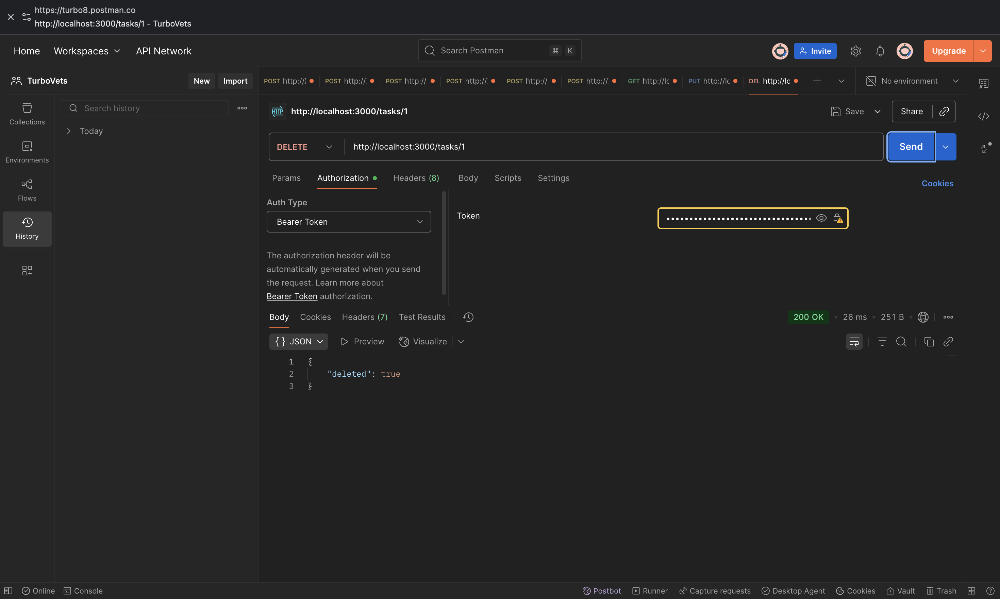

# Task Management System – RBAC Challenge


## Table of Contents
- [Setup Instructions](#setup-instructions)
- [.env Setup](#env-setup)
- [Architecture Overview](#architecture-overview)
- [Data Model Explanation](#data-model-explanation)
- [Access Control Implementation](#access-control-implementation)
- [API Docs](#api-docs)
- [Testing & Results](#testing--results)
- [Features](#features)
- [Future Considerations](#future-considerations)

---


## Setup Instructions

### 1. Nx Monorepo (`rbac-challenge`)
```sh
cd rbac-challenge
npm install
npx nx run-many --target=build --all
npx nx serve api
```

### 2. Backend (`task-backend`)
```sh
cd task-backend
npm install
cp .env.example .env # Edit secrets and DB config as needed
npm run start:dev
# (Optional) npm run seed
```

### 3. Frontend (`task-dashboard`)
```sh
cd task-dashboard
npm install
cp .env.example .env # If required for API base URL
ng serve
# Access at http://localhost:4200
```

---

## .env Setup

Create a `.env` file in both `task-backend` and (if needed) `task-dashboard`:

**task-backend/.env**
```
JWT_SECRET=your_jwt_secret
DB_TYPE=sqlite
DB_PATH=./mydatabase.db
# Add other DB or mail configs as needed
```

**task-dashboard/.env** (if API URL or other env needed)
```
API_BASE_URL=http://localhost:3000
```

---

## .env Setup

Create a `.env` file in both `task-backend` and (if needed) `task-dashboard`:

**task-backend/.env**
```
JWT_SECRET=your_jwt_secret
DB_TYPE=sqlite
DB_PATH=./mydatabase.db
# Add other DB or mail configs as needed
```

**task-dashboard/.env** (if API URL or other env needed)
```
API_BASE_URL=http://localhost:3000
```

---

---


## Architecture Overview

This project uses an Nx monorepo for scalable, maintainable code organization. The rationale:
- **Separation of concerns**: Isolates backend, frontend, and shared logic.
- **Code sharing**: Shared libraries for auth, data models, and utilities.
- **Scalability**: Easy to add new apps or libraries as the system grows.

**Monorepo Layout:**
- `rbac-challenge/` (Nx root)
  - `apps/api/` – Backend API (NestJS, placeholder for future integration)
  - `apps/dashboard/` – Angular frontend (placeholder)
  - `libs/auth/` – Shared authentication logic (JWT, guards, decorators)
  - `libs/data/` – Shared data models and DB logic
- `task-backend/` – Main working backend (NestJS, TypeORM, SQLite)
- `task-dashboard/` – Main working frontend (Angular, NgRx)

**Shared Libraries/Modules:**
- `libs/auth`: JWT utilities, guards, role/permission decorators
- `libs/data`: TypeORM entities, DTOs, validation logic

> **Current State:** Backend and frontend run as separate projects. Nx monorepo is prepared for future full-stack integration.

---

---


## Data Model Explanation

The system uses a relational schema for RBAC and task management. Key entities:

- **User**: id, username, passwordHash, roles, organizationId
- **Role**: id, name, permissions
- **Permission**: id, action, resource
- **Task**: id, title, description, assignedTo, organizationId
- **Organization**: id, name, parentId (for hierarchy)

**ERD / Diagram:**


---


## Access Control Implementation

- **Roles & Permissions**: Users are assigned roles; roles have permissions (e.g., `create_task`, `delete_user`).
- **Organization Hierarchy**: Each user and task belongs to an organization. Hierarchies allow for delegated admin.
- **JWT Auth**: On login, users receive a JWT. All protected endpoints require a valid JWT.
- **Integration**: Guards and decorators check JWT and permissions before allowing access to endpoints.

**How it works:**
- Only users with the correct permission in their org can perform actions (e.g., only users with `delete_task` can delete tasks in their org).
- Admins can manage users/roles within their org or delegated orgs.
- JWT tokens are checked on every protected endpoint. Custom guards and decorators enforce RBAC at the controller/service level.

---


## API Docs

### Endpoints

- `POST /auth/login` – User login
- `POST /auth/register` – Register user
- `GET /tasks` – List tasks
- `POST /tasks` – Create task
- `PUT /tasks/:id` – Update task
- `GET /users` – List users (admin only)
- `GET /audit-log` – Create role (admin only)


### Postman Screenshots





---

---


## Testing & Results

**Front End Test:**


**Back End Test:**


## Features

### Implemented
- User authentication (JWT)
- Role-based access control (RBAC)
- Task CRUD (backend)
- Angular dashboard (frontend, dummy data)
- Nx monorepo structure for future scalability
- Use Nx monorepo for full-stack integration 
- UI enhancements (drag-and-drop, dark mode)
- Advanced state management (NgRx)

### Pending / In Progress
- Connect frontend to backend API
- Use Nx monorepo for full-stack integration
- Audit logging, rate limiting, 2FA
- Comprehensive tests and CI/CD

---

---


## Future Considerations

- **Advanced Role Delegation**: Support for delegated admin, org-level role inheritance
- **Production Security**: JWT refresh tokens, CSRF protection, RBAC caching
- **Efficient Permission Checks**: Caching, query optimization for large orgs
- **Scalability**: PostgreSQL, Redis, microservices
- **Testing & CI/CD**: More unit/e2e tests, automated pipelines

---
